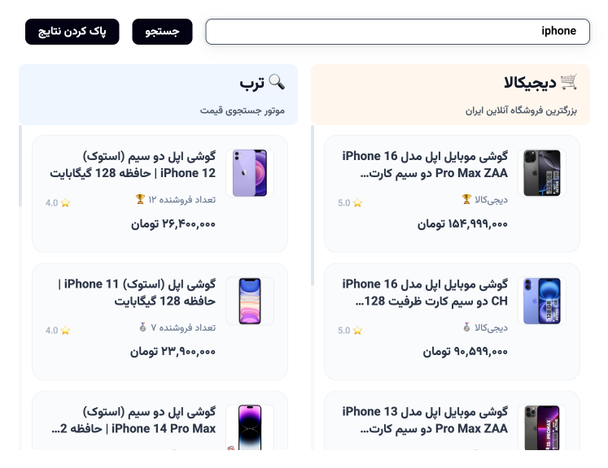

# 🛍️ Digikala & Torob Price Finder Extension

<div align="center">


**The Ultimate Price Comparison Tool for Iranian E-commerce**

_Find the best deals on Digikala and Torob with automatic price comparison and universal product detection_

[](chrome/)
[](firefox/)

</div>

## ✨ Features

### 🤖 **Automatic Product Detection**

- Instantly detects products on Digikala and Torob pages
- Extracts product information automatically
- Works across multiple e-commerce platforms

### 💰 **Smart Price Comparison**

- Compare prices from different sellers for the same product
- Shows seller ratings and reliability scores
- Real-time price updates using official APIs
- Sort results by price (lowest to highest)

### 🔍 **Universal Search**

- Search for products manually through the popup
- Persian/Farsi language support with RTL design
- Auto-complete suggestions powered by Digikala API

### 🎨 **Beautiful Interface**

- Clean, modern Persian UI
- Floating widgets that don't interfere with browsing
- Responsive design optimized for extension popup

## 📱 Screenshots

### Extension Popup Interface

The extension popup provides easy access to search functionality and comparison tools:


### Price Comparison Results

View multiple product options with prices, ratings, and seller information:



### Automatic Product Detection

When viewing a product page, the extension automatically detects and shows comparison options:


### Product Variants Display

Compare different variants and configurations of the same product:


## 📥 Download & Installation

### Chrome Extension

#### Option 1: Direct Download (Recommended)

1. **[Download the Chrome Extension (.crx file)](https://github.com/amiralibg/DigikalaExtention/releases/latest/download/digikala-price-finder-chrome.crx)**
2. Open Chrome and navigate to `chrome://extensions/`
3. Enable "Developer mode" in the top right corner
4. Drag and drop the `.crx` file onto the extensions page
5. Click "Add Extension" when prompted

#### Option 2: Load Unpacked (For Developers)

1. Clone or download this repository
2. Navigate to `chrome://extensions/`
3. Enable "Developer mode"
4. Click "Load unpacked" and select the `chrome/` folder
5. The extension will appear in your extensions list

### Firefox Add-on

#### Option 1: Direct Download

1. **[Download the Firefox Add-on (.xpi file)](https://github.com/amiralibg/DigikalaExtention/releases/latest/download/digikala-price-finder-firefox.xpi)**
2. Open Firefox and navigate to `about:addons`
3. Click the gear icon and select "Install Add-on From File"
4. Select the downloaded `.xpi` file
5. Click "Add" when prompted

#### Option 2: Temporary Installation (For Developers)

1. Navigate to `about:debugging#/runtime/this-firefox`
2. Click "Load Temporary Add-on"
3. Select the `firefox/manifest.json` file
4. The extension will be installed temporarily

## 🚀 How to Use

### 1. **Automatic Detection**

- Visit any Digikala product page (e.g., `https://www.digikala.com/product/dkp-11022424/`)
- The extension automatically detects the product and shows price comparison options
- A floating widget appears with relevant information

### 2. **Manual Search**

- Click the extension icon in your browser toolbar
- Enter a product name in Persian or English
- Browse through the search results and price comparisons

### 3. **Price Comparison**

- View prices from different sellers
- Check seller ratings and reliability scores
- Click on any result to visit the product page

## 🏗️ Technical Details

### Architecture

- **Chrome**: Manifest V3 with service worker
- **Firefox**: WebExtensions API compatible
- **Content Scripts**: Injected on product pages for data extraction
- **Background Service**: Handles API calls and message passing

### API Integration

- **Digikala API**: Official endpoints for product data and search
- **Torob API**: Price comparison and product information
- Real-time data fetching with error handling

### Security Features

- Scoped permissions to specific e-commerce domains
- No sensitive data storage or transmission
- Content Security Policy compliant
- Safe product data extraction with comprehensive error handling

## 🛠️ Development

### Project Structure

```
DigikalaExtention/
├── chrome/                 # Chrome extension (Manifest V3)
├── firefox/               # Firefox extension (WebExtensions)
├── screenshots/           # Extension screenshots
├── CLAUDE.md             # Development guidance
└── README.md             # This file
```

### Building Extensions

- Chrome: Use the `chrome/` directory directly
- Firefox: Use the `firefox/` directory directly
- Both versions share core functionality with platform-specific manifests

### Testing URLs

- **Digikala**: `https://www.digikala.com/product/dkp-11022424/`
- **Torob**: `https://torob.com/p/[product-id]/`

## 🌍 Language Support

- **Primary**: Persian/Farsi with RTL support
- **Secondary**: English for technical elements
- **Fonts**: Vazirmatn font family included
- **Currency**: Toman formatting and display

## ⚖️ Legal & Ethics

This extension is designed for:

- ✅ Educational purposes and legitimate price comparison
- ✅ Helping consumers find better deals
- ✅ Transparent price information access

Please ensure compliance with:

- Website terms of service
- Applicable local laws
- Ethical web scraping practices
- Rate limiting for API calls

## 🤝 Contributing

Contributions are welcome! Please:

1. Fork the repository
2. Create a feature branch
3. Implement your changes
4. Test on both Chrome and Firefox
5. Submit a pull request

### Development Guidelines

- Follow existing code patterns and styling
- Maintain security best practices
- Test thoroughly on target websites
- Update documentation as needed

## 📞 Support

- **Issues**: [GitHub Issues](https://github.com/amiralibg/DigikalaExtention/issues)
- **Documentation**: [CLAUDE.md](CLAUDE.md)
- **License**: Educational use only

## 🏷️ Version History

- **v2.0**: Added Torob support and universal product detection
- **v1.0**: Initial release with Digikala integration

---

<div align="center">

**Made with ❤️ for Iranian e-commerce consumers**

_This project is for educational and legitimate price comparison purposes only_

</div>
